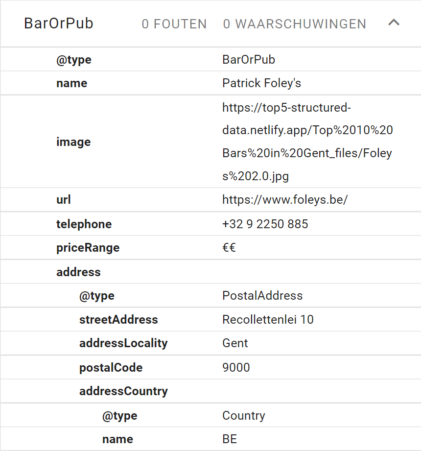
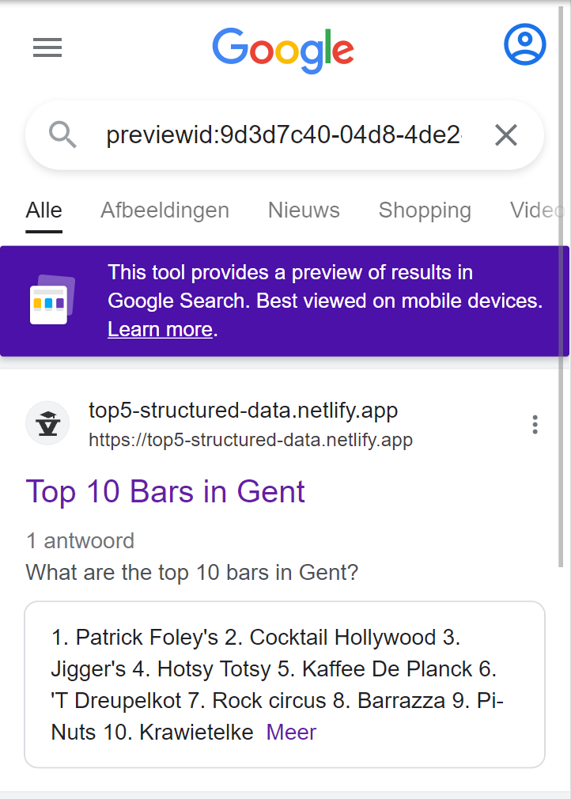

# Top5Gent schema.org rewrite

In this project we rewrite the [Top 10 Bars in Gent](https://top5gent.be/blog/top-10-bars-in-gent) blogpost and add stuctured data schema's using JSON-LD.

## Rewrite

### JSON-LD examples

- QAPage
  https://github.com/bengeendokter/HOGENT-top5-structured-data/blob/8a57e284fec40710ab6e324912f4a02da4dc3171/public/index.html#L71-L94
- PubOrBar
  https://github.com/bengeendokter/HOGENT-top5-structured-data/blob/8a57e284fec40710ab6e324912f4a02da4dc3171/public/index.html#L95-L110

### Links

- [live site](https://top5-structured-data.netlify.app)
- using [schema.org validator](https://validator.schema.org/#url=https%3A%2F%2Ftop5-structured-data.netlify.app)

- using [Google rich results validator](https://search.google.com/test/rich-results/result?id=wyayWg9_UK4oeJDx_eDH7Q)
- Google [search result preview](https://search.google.com/test/rich-results/result/preview?id=wyayWg9_UK4oeJDx_eDH7Q)

## Original Site

### Links

- [live site](https://top5gent.be/blog/top-10-bars-in-gent)
- using [schema.org validator](https://validator.schema.org/#url=https%3A%2F%2Ftop5gent.be%2Fblog%2Ftop-10-bars-in-gent)
- using [Google rich results validator](https://search.google.com/test/rich-results/result?id=gwBuNO3oZV-M9hZ7W118bg)
